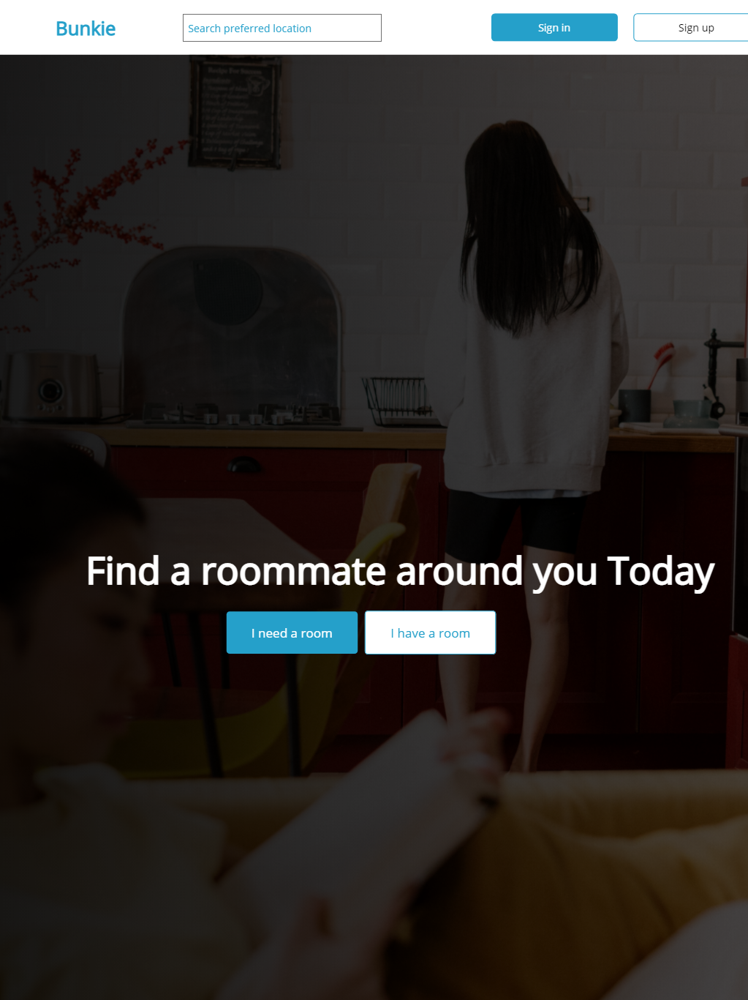

# Backend repository for Team 83 Bunkie project

## Project Description

This project seeks to proffer a solution to one of the draining problems university students face: getting a decent accommodation and a compatible roommate to live with to split room costs.

## Problem Statement

Most students face the problem of finding roommates with whom they can share a room and the cost. This is becoming so dire now that university hotels do not have enough dorms to accommodate students, and also most of these dorms are not even entirely conducive that people would prefer to stay off-campus, which could be expensive if you are alone and also proves difficult to look for a roommate with whom you can share the cost.

## API Details

1. Sign up - store name, store address, email, social media handle, password, store contact details

2. Sign in - email, password

3. Store information creation

4. Store information retrieval

5. Store information update - all details fields

6. Store information deletion - all details fields

## Built with

- Python
- Django

## API Description

The application is a REST API written in Python

- REST API

## Dev Contribution Guide

1. Fork the repo.

2. Clone the repo into your local machine.

3. Create an upstream on your local machine to pull the latest code from the develop branch of this repository

4. Create a new branch on your local machine.

5. Switch to the branch and make all changes on that branch.

6. Commit changes to the branch and push to your forked repo.

7. Come back to this repo and open a pull request on the develop branch.

8. Link the pull request with your issue.

9. Do not merge your pull request yourself. Wait for review and merging.

## Installation

## User Guide

In progress.

# RESTAPI Docs

I have added `drf-yasg` for API documentation which can be accessed after running the backend server and going to following links:

Swagger UI docs: http://127.0.0.1:8000/swagger/

Redoc UI docs: http://127.0.0.1:8000/redoc/

While working with api in browser, you can login using `http://127.0.0.1:8000/api-auth/login` link.

### Endpoints

Brief explanation of endpoints:

| Function                               | REQUEST    | Endpoint                             | Authorization | form-data                 |
| -------------------------------------- | ---------- | ------------------------------------ | ------------- | ------------------------- |
| Create new user                        | POST       | http://127.0.0.1:8000/user/register/ | Not Required  | username, email, password |
| Returns list of all existing users     | GET        | http://127.0.0.1:8000/user/          | Basic Auth    |                           |
| Returns the detail of an user instance | GET        | http://127.0.0.1:8000/user/{int:id}/ | Basic Auth    |                           |
| Update the detail of an user instance  | PUT, PATCH | http://127.0.0.1:8000/user/{int:id}/ | Basic Auth    |                           |
| Delete an user instance                | DELETE     | http://127.0.0.1:8000/user/{int:id}/ | Basic Auth    |                           |
|                                        |            |                                      |               |                           |

| Returns a list of all existing

## PJT-83 Backend Contributors

Subomi Samuel

- GitHub - https://github.com/Subomi-samuel

Ajayi Olamide Peter

- GitHub - https://github.com/horlamiedea

Baiye Moyosore

- GitHub - https://github.com/mbaiye

Joseph Chinedu

- GitHub - https://github.com/josephchinedu
